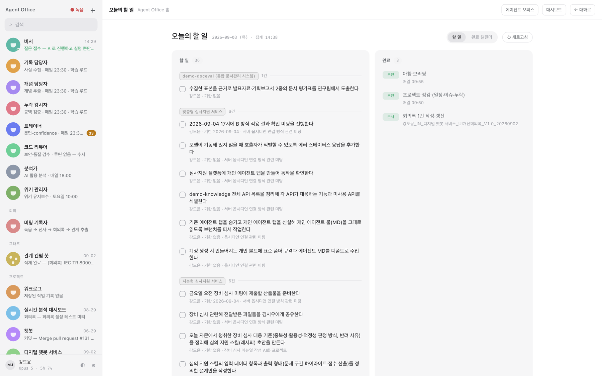
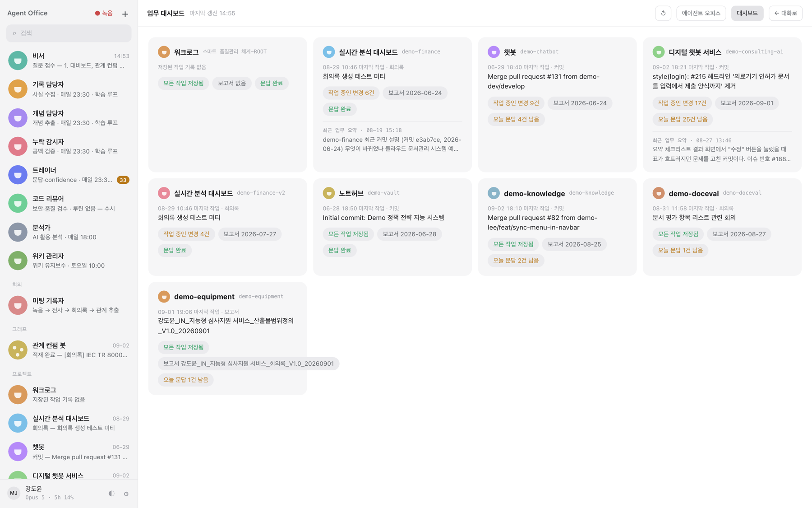
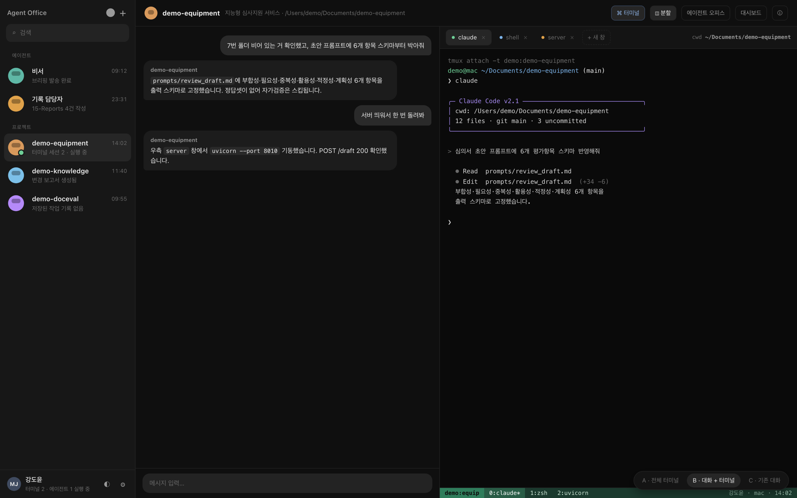
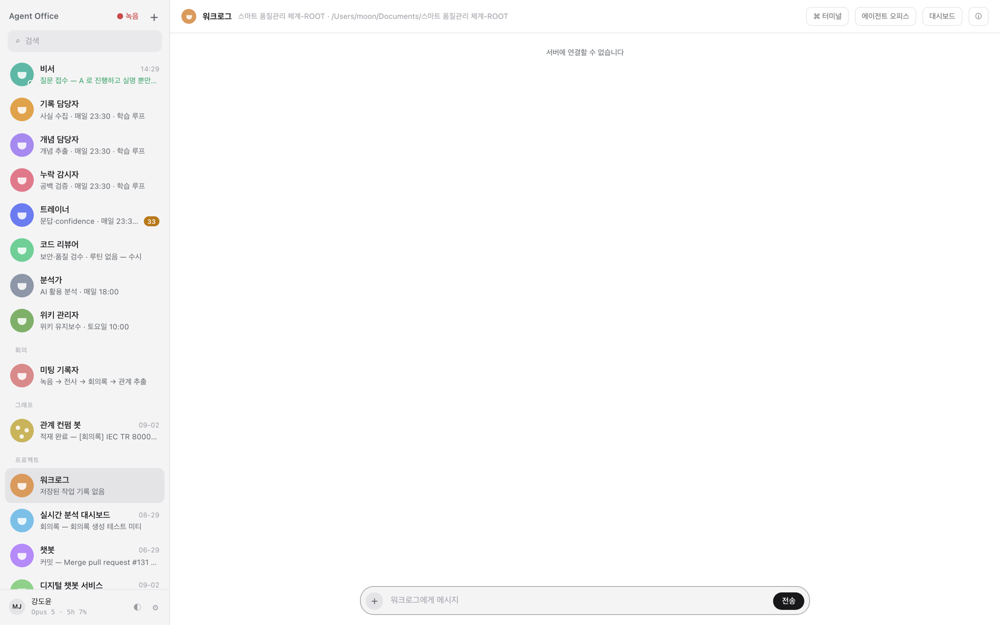
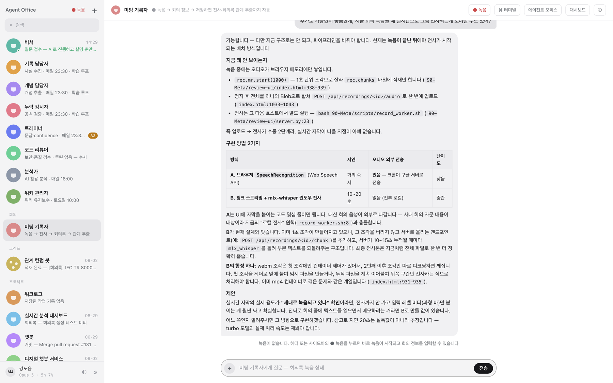
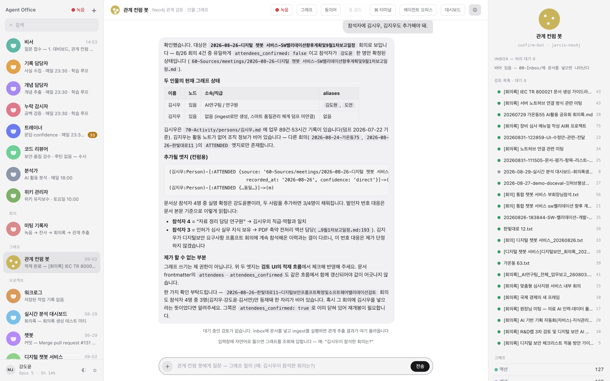
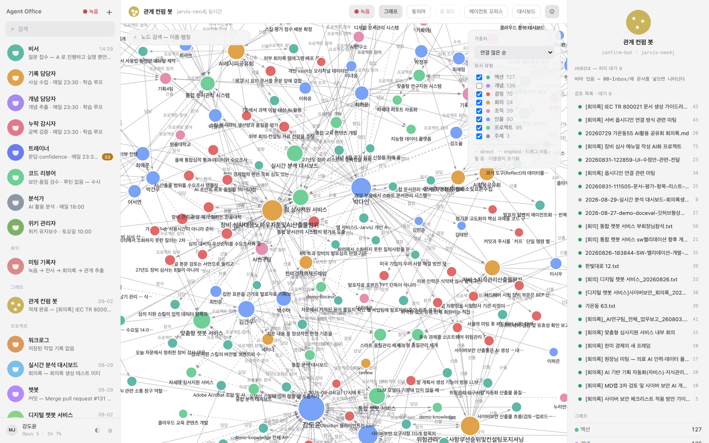

# Agent Office

Obsidian 볼트 위에서 도는 개인 AI 비서 워크스페이스. 회의 녹음·전사, 지식 위키 환류,
인물/프로젝트 그래프(Neo4j), 에이전트 실시간 관제 맵을 한 화면에서 다룬다.

**클론이 곧 볼트다.** 별도 생성 절차 없이 클론한 폴더가 그대로 볼트 루트가 된다.

> 아래 화면은 모두 실제 동작 화면이며, 인물·조직·사업명은 데모 값으로 치환한 상태다.

---

## 무엇이 되는가

### 1. 오늘의 할 일 — 회의록과 커밋에서 자동 수집



회의록의 액션 아이템과 각 repo의 변경 이력을 담당자·기한·출처 회의 기준으로 묶어 보여준다.
좌측은 역할별 에이전트 목록이며, 각 에이전트는 자기 루틴 시각(예: `매일 23:30 · 학습 루프`)에
스스로 돈다. 우측 완료 칸에는 그날 실행된 루틴과 생성된 문서가 쌓인다.

### 2. 업무 대시보드 — repo별 상태 한 판



`90-Meta/repos.md`에 등록한 repo마다 마지막 작업 시각, 미커밋 변경 건수, 최신 보고서 날짜,
남은 문답 수를 카드로 보여준다. "작업 중인 변경 17건 / 오늘 문답 25건 남음"처럼 **손대야 할
곳이 먼저 눈에 들어오게** 만든 화면이다.

### 3. 에이전트 채팅 + 터미널 — 대화와 실행이 한 화면



프로젝트별 에이전트에게 지시하면 우측 터미널(tmux)에서 Claude Code가 실제로 파일을 고치고
서버를 띄운다. 대화 로그와 실행 화면이 같은 화면에 있어 무엇을 근거로 무엇을 바꿨는지
따라갈 수 있다. 전체 터미널 / 대화+터미널 / 대화만 3가지 레이아웃을 토글한다.



### 4. 회의 실시간 보조 — 녹음 → 전사 → 회의록 → 관계 추출



헤더의 녹음 버튼으로 회의를 녹음하면 로컬 전사(mlx-whisper) → 회의록 초안 → 참석자·결정·
액션 아이템 추출까지 이어진다. 음성은 외부로 나가지 않는다. 회의 중에는 답변 도우미 모드로
질의에 근거를 붙여 답한다.

### 5. 관계 컨펌 봇 — 그래프에 넣기 전에 사람이 검토



`/ingest`가 문서에서 뽑아낸 관계(참석·담당·결정)를 **바로 쓰지 않고** 검토 목록에 올린다.
봇은 근거 문서 경로와 추가될 Cypher 엣지를 제시하고, 확신이 없는 항목은 단정하지 않는다.
자연어로 물으면 그래프를 조회해 답한다 — "김시우가 참석한 회의는?"

### 6. 인물·프로젝트 그래프



Neo4j에 적재된 인물·프로젝트·회의·결정·액션을 연결 수 기준으로 펼친다. 노드 유형별 필터,
이름 검색, `direct`/`implied` 확신도 구분을 지원한다. 모든 엣지는 출처 문서 경로(`source`)를
갖는다. (캡처는 인물 80명 · 프로젝트 95건 · 회의 24건 · 결정 70건 · 액션 127건 적재 상태)

---

## 빠른 시작

```bash
git clone https://github.com/devmoonjs/Agent_Office.git
cd Agent_Office
bash setup.sh                       # 파이썬 의존성 + 90-Meta/.env 생성
python3 90-Meta/map-ui/server.py    # http://127.0.0.1:57910
```

## 구성

| 경로 | 역할 |
|---|---|
| `00-Inbox/` | 외부 문서 투입구 (`/ingest`가 처리) |
| `10-Daily/` `15-Reports/` | 일일 학습 노트 · 프로젝트 변경 보고서 |
| `20-Wiki/` | 원자 단위 지식 위키 |
| `60-Sources/` | 처리 완료 원본 아카이브 |
| `90-Meta/map-ui/` | Agent Office UI + API 서버 (`server.py`) |
| `90-Meta/scripts/` | 수집·전사·동기화 스크립트 |
| `90-Meta/neo4j/` | 그래프 DB 구성 (`docker compose up -d`) |
| `.claude/skills/` | `/daily-review` `/ingest` `/graph` 등 스킬 |

## 설정

사용자 파일은 git 추적 대상이 아니다. `setup.sh`가 예시 파일을 복사해 만들며, 업데이트해도 덮어쓰지 않는다.

- `90-Meta/repos.md` — 분석 대상 폴더 절대경로를 한 줄에 하나씩. 설정 화면에서 추가해도 된다.
- `90-Meta/.env` — 토큰(텔레그램·Notion 등 선택 기능용).
- `CLAUDE.local.md` — 에이전트 운영 규칙에 덧붙일 내 규칙. `CLAUDE.md`는 업데이트로 갱신되므로 직접 고치지 않는다.

## 업데이트

새 버전이 나오면 설정(⚙) 버튼에 점이 찍힌다. 설정 화면 > **버전** 절의 `[업데이트]`를 누르면
진행률 게이지와 로그를 보여주면서 내려받고, 끝나면 서버를 재시작한 뒤 화면을 새로고침한다.
터미널을 열 필요가 없다.

```
[3/5] 새 버전 내려받기
████████████░░░░░░░░  60%
```

터미널에서 하려면:

```bash
cd ~/Agent_Office
bash update.sh --check    # 상태만 조회 (JSON)
bash update.sh            # 업데이트
bash update.sh --force    # 로컬 수정을 .agent-office/backup/ 에 백업한 뒤 덮어쓰기
```

사용자 파일(`90-Meta/repos.md`, `90-Meta/.env`, `.agent-office/`, 볼트 노트)은 git 추적
대상이 아니므로 업데이트가 덮어쓰지 않는다.

## 윈도우 설치 (WSL2)

네이티브 윈도우는 지원하지 않는다. WSL2 Ubuntu 안에서 클론한다.

### 자동 설치 — 관리자 PowerShell에 한 줄

```powershell
irm https://raw.githubusercontent.com/devmoonjs/Agent_Office/main/install.ps1 | iex
```

WSL2 확인 → Ubuntu 패키지 → Claude Code → 클론 → 점검 → 서버 기동까지 처리한다. 재실행해도 안전하다.

WSL2가 처음이면 1단계에서 멈추고 재부팅을 안내한다. 재부팅 후 시작 메뉴에서 **Ubuntu**를 열어
사용자명과 비밀번호를 만든 다음, 같은 명령을 한 번 더 실행하면 이어진다.

> 스크립트 파일을 직접 받아 실행하려면 인코딩에 주의한다. `.ps1`은 UTF-8 **BOM**으로
> 저장돼야 Windows PowerShell 5.1이 한글을 바르게 읽는다. `irm | iex` 방식은 이 문제가 없다.

### 수동 설치 (Ubuntu 터미널)

```bash
sudo apt update && sudo apt install -y git python3 python3-pip tmux pandoc ffmpeg curl
sudo curl -fsSL "https://github.com/tsl0922/ttyd/releases/latest/download/ttyd.$(uname -m)" -o /usr/local/bin/ttyd
sudo chmod +x /usr/local/bin/ttyd
curl -fsSL https://claude.ai/install.sh | bash      # Node.js 불필요
git clone https://github.com/devmoonjs/Agent_Office.git ~/Agent_Office
cd ~/Agent_Office && bash setup.sh
claude                              # 브라우저 로그인
python3 90-Meta/map-ui/server.py    # 윈도우 브라우저에서 http://127.0.0.1:57910
```

Claude Code는 npm 전역 설치를 쓰지 않는다. npm 11.19+가 install script를 기본 차단해
`postinstall`이 건너뛰어지고 반쪽 설치가 되기 때문이다. 공식 설치 스크립트는 `~/.local/bin`에
넣으므로 Node.js 자체가 필요 없다(Codex CLI를 쓸 때만 별도로 설치한다).

### 반드시 지킬 것

- **분석 대상 폴더는 WSL 안에 둔다.** `/mnt/c/...` 경로는 git diff가 느리고 파일 감시가 불안정하다
- **스케줄러**: launchd 대신 cron. 재부팅 시 `wsl -d Ubuntu -- true`를 작업 스케줄러에 등록하거나 `/etc/wsl.conf`의 `[boot] systemd=true`로 cron을 살린다
- **회의 전사**: faster-whisper(CPU)로 자동 폴백. GPU 없으면 1시간 녹음에 10분 이상

상세 절차, 문제 해결, 미검증 항목은 [`docs/WINDOWS.md`](docs/WINDOWS.md) 참조.

## 요구 사항

- **Claude Code 또는 codex CLI** — 스킬 실행과 데스크 에이전트 구동에 필요
- **Python 3** — map-ui, 동기화 스크립트. 관제 UI 표출 자체는 Python 3만으로 된다
- **Docker** — Neo4j 그래프 옵션에만. **Neo4j 없이도 UI·스킬 대부분은 동작한다**
  (`/graph` 스킬과 위 5·6번 화면만 보류됨). 설정에서 그래프를 비활성(기본)으로 두면 관련 지시가 아예 삽입되지 않는다
- **회의 녹음/전사** — macOS(Apple Silicon): mlx-whisper, Linux/WSL: faster-whisper로 자동 폴백. 설정에서 전사 모델(small/medium)을 선택할 수 있다
- **docx 변환** — macOS: `textutil`(내장), Linux: `pandoc`(`apt install pandoc`)

## 주의

- **인증이 없다.** `127.0.0.1` 바인딩을 바꾸지 말고, 원격 접근이 필요하면 Tailscale 같은
  사설망을 사용할 것
- 터미널 탭은 로컬 셸에 그대로 붙는다. 공유 네트워크에 노출하면 셸 접근을 내주는 것과 같다
- diff 수집 시 시크릿 패턴은 마스킹되지만, 회의록·문서 본문에 들어간 민감 정보는 걸러지지 않는다

## 라이선스

MIT — `LICENSE` 참조.
